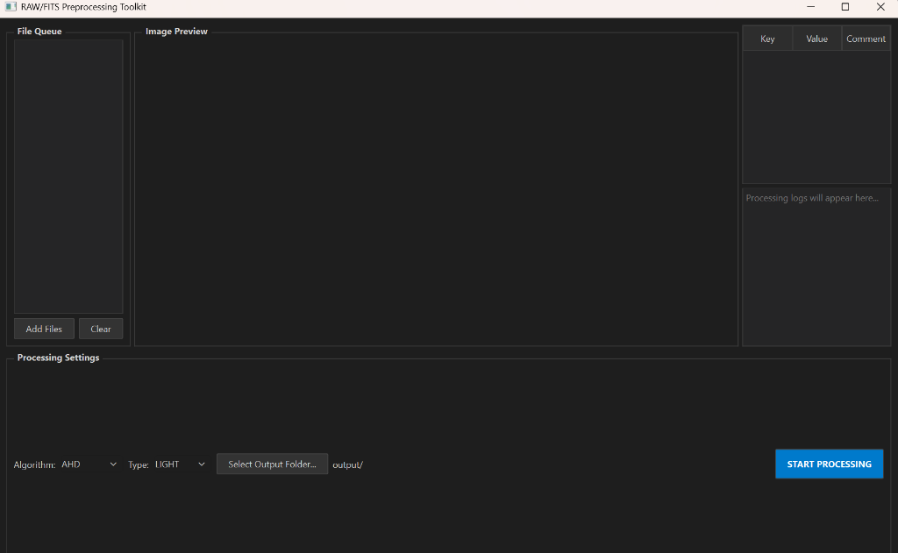

# RAW/FITS Preprocessing Toolkit

A professional ingestion and standardization engine for astrophotography. This toolkit bridges the gap between proprietary DSLR/Mirrorless RAW formats and the industry-standard FITS (Flexible Image Transport System) format, ensuring linear data integrity for math-heavy processing.

 *(Note: GUI features a modern dark-mode interface with real-time image rendering)*

## 🔭 Features

- **Linear debayering**: Uses `rawpy` (LibRaw) to extract strictly linear RGB arrays from `.CR2`, `.NEF`, `.ARW`, and `.DNG` files, avoiding camera-applied curves or clipping.
- **FITS Header Management**: Read, write, and edit FITS header cards. Standardizes image metadata for downstream stacking software.
- **Auto-Stretched Preview**: A built-in previewer that automatically stretches dark astronomical frames (using percentile-based scaling) so the data is visible during ingestion.
- **High Precision**: Converts all incoming data to 32-bit floating point arrays normalized to `[0.0, 1.0]`.
- **Dual Interface**:
  - **Modern GUI**: A PyQt6-based dashboard for drag-and-drop ingestion, header inspection, and batch monitoring.
  - **CLI Batch Mode**: A command-line interface for headless server processing or integration into larger pipelines.

## 🛠️ Installation

1. **Clone the repository**:
   ```bash
   git clone https://github.com/raymborres07/raw-fits-preprocessing-toolkit.git
   cd raw-fits-preprocessing-toolkit
   ```

2. **Install dependencies**:
   ```bash
   pip install -r requirements.txt
   ```

## 🚀 Usage

### GUI Mode (Standard)
Simply run the main application to launch the graphical interface:
```bash
python main.py
```

### CLI Mode (Batch)
For automated processing of a directory:
```bash
python main.py --cli --input ./my_raw_files --output ./processed_fits
```

## 📂 Project Structure

- `toolkit.py`: The core ingestion engine and image processing logic.
- `app.py`: The PyQt6 graphical interface and background worker threads.
- `main.py`: Entry point for both GUI and CLI modes.
- `requirements.txt`: Python package dependencies.

## 🧪 Technologies

- **Python 3.11+**
- **Astropy**: Standard astronomical data handling.
- **Rawpy**: High-fidelity RAW image processing via LibRaw.
- **NumPy**: High-performance array operations.
- **PyQt6**: Modern desktop UI framework.
- **Matplotlib**: Image rendering and histogram calculation.

---
Created by [raymborres07](https://github.com/raymborres07)
